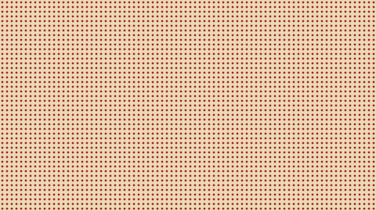

Φέτος το Φεστιβάλ Πηλίου μάς κάλεσε για τρεις νύχτες στη σειρά, σε τρεις διαφορετικές πλατείες. Κάθε βράδυ ξεκινούσαμε όταν έπεφτε ο ήλιος και σταματούσαμε όταν τα μικρότερα παιδιά αποκοιμιούνταν στις αγκαλιές των γονιών τους.

Δεν είχαμε σκηνή. Είχαμε ένα πλατάνι, μερικά φανάρια κρεμασμένα στα κλαδιά του και καθίσματα απλωμένα σε κύκλο. Αυτό ήταν αρκετό.

## Η πρώτη νύχτα

Ξεκινήσαμε με ιστορίες από το ίδιο το βουνό: για τις νεράιδες των πηγών, για τον γίγαντα που φύλαγε τα κάστανα και για τη γριά που ήξερε να μιλά με τον αέρα. Τα παιδιά μπροστά, οι μεγάλοι πίσω, και κάποιοι παππούδες που ήξεραν τις ιστορίες καλύτερα από εμάς και μας διόρθωναν χαμογελώντας.

> Αυτή την ιστορία μου την έλεγε η γιαγιά μου. Δεν την είχα ξανακούσει από τότε που ήμουν παιδί.

Η φράση αυτή ειπώθηκε στο τέλος της πρώτης βραδιάς, από μια κυρία που είχε καθίσει στην τελευταία σειρά. Για τέτοιες στιγμές λέμε ιστορίες.

## Τι κρατάμε

Από τις τρεις νύχτες κρατάμε μερικά πράγματα που θέλουμε να θυμόμαστε:

- ότι ένα πλατάνι είναι καλύτερη σκηνή από κάθε αίθουσα,
- ότι τα παιδιά ακούνε καλύτερα όταν μπορούν να κάθονται στο χώμα,
- ότι οι μεγάλοι ζητούν πάντα «άλλο ένα» πιο επίμονα από τα παιδιά,
- και ότι μια ιστορία που κρατά ως τα μεσάνυχτα δεν είναι ποτέ πολύ μεγάλη.

## Η τελευταία νύχτα

Την τρίτη βραδιά αφηγηθήκαμε ένα μεγάλο παραμύθι σε τρία κομμάτια, με διαλείμματα για τσάι του βουνού. Όταν τελείωσε, κανείς δεν σηκώθηκε αμέσως. Μείναμε όλοι λίγο ακόμα κάτω από το πλατάνι, ακούγοντας τον αέρα.

Ευχαριστούμε το Φεστιβάλ Πηλίου και όλους όσοι ήρθαν. Του χρόνου, πάλι εδώ.
